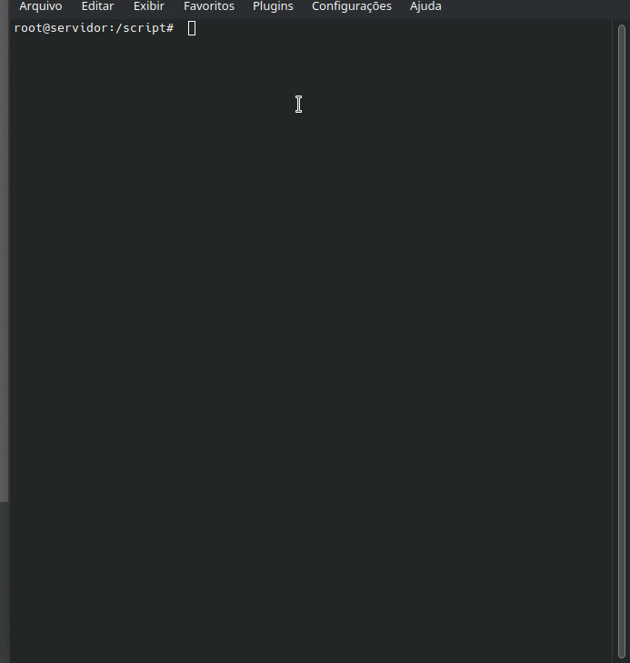

# Olá, eu sou a Guilherme! 👋


## 🚀 Sobre mim
Estou me especializando na área de DevOps, SRE ... 


## 🛠 Habilidades
Linux, Docker, Git, Python, Terraform, AWS, AZURE, GCP... 

# Desafio de criar uma IaC para gerenciar grupos e usuários no Linux - DIO 


Neste desafio, foi criado um script sh para rodar no shell onde foi criado toda a infraestrutura de usuários, grupos de usuários, diretórios e permissões serão feitas automaticamente. 

  
## Funcionalidades 

- Criação de Pastas.
- Criação de Grupos e Usuários. 
- Gerenciamento de Usuários, Grupos e Pastas. 

## Descrição de como foi criado script e que cada linha faz.

#### Primeiro passo foi criar um arquivo chamado iacl.sh. Com o comando "touch" que serve para criar arquivos em branco, com qualquer extensão. 

```
touch iacl.sh
```

#### Apos a crianção do arquivo foi, foi feito a edição do mesmo atraves de um editor de texto, eu utilizei o nano, mas pode ser utilizado o VIM, VI ou VSCODE, ou de sua preferencia.

```
nano iacl.sh
```

#### Na primeira linha e necessario por a informar que sera executado o Script então necessario informar no topo do arquivo.  

```
#! bin/bash
```

#### A parti da segunda linha ja foi iniado os comandos que serão executado pelo shell, terminal, primeiro comando e de crianção de pastas, com o Comando "mkdir" serve para criar pastas.

```
mkdir /publico
mkdir /adm
mkdir /ven
mkdir /sec
```

#### Segundo comando foi para a criação dos grupos, que vão gerenciar as pastas e também usuarios. Foi utilizado o comando "groupadd" que serve para adicionar grupos

```
groupadd GRP_ADM
groupadd GRP_VEN
groupadd GRP_SEC
```

#### Terceiro comando do script foi para criar os usuarios, que vão ser adicionados nos grupos para ter acesso as pastas. Utiliazado o comando "useradd" que serve para criar os usuarios e foi utilizado.

##### -m = Serve para criar pasta HOME do Usuario
##### -s  = Utilizado para escolher o modelo de shell que o usario vai ter acesso . /bin/bash 
##### -p  = Para ja informar a senha pre estabelecida.
##### -G = Utilizado para incluir usuario em mais de um grupo.


```
useradd carlos  -m -s /bin/bash -p $(openssl passwd Senha123) -G GRP_ADM
useradd maria  -m -s /bin/bash -p $(openssl passwd Senha123) -G GRP_ADM
useradd joao  -m -s /bin/bash -p $(openssl passwd Senha123) -G GRP_ADM

useradd debora  -m -s /bin/bash -p $(openssl passwd Senha123) -G GRP_VEN
useradd sebastiana  -m -s /bin/bash -p $(openssl passwd Senha123) -G GRP_VEN
useradd roberto  -m -s /bin/bash -p $(openssl passwd Senha123) -G GRP_VEN

useradd josefina  -m -s /bin/bash -p $(openssl passwd Senha123) -G GRP_SEC
useradd amanda  -m -s /bin/bash -p $(openssl passwd Senha123) -G GRP_SEC
useradd rogerio  -m -s /bin/bash -p $(openssl passwd Senha123) -G GRP_SEC
```
#### Quarto comando foi expiração de senha atraves do comando "passwd -e" que serve para gerenciar senhas.

######  -e =  passa a considerar a senha expirada.


```
passwd -e carlos
passwd -e maria
passwd -e joao
passwd -e debora
passwd -e sebastiana
passwd -e josefina
passwd -e amanda
passwd -e rogerio

```

#### Quindo compando, foi utilizado o "chown", serve para realizar o gerenciamento de criador da pasta e grupo responsavel por ela.Foi utilizado para vincular os grupos responsavel por cada pasta.

```
chown root:GRP_ADM /adm
chown root:GRP_VEN /ven
chown root:GRP_SEC /sec
```

##### Sexto comando, foi para realizar gerenciamento de , execução, gravação e leitura da pasta que foi utilizado o "chmod" 

###### 770 = significa que o dono da pasta e grupo terão todas as funcionalidades de salvar arquivos, abrir e executar e visitantes não iram poder entrar.

###### 777 = Informa que todos terão acesso a pasta, para salvar arquivos, ler e executar.

```
chmod 770 /adm
chmod 770 /ven
chmod 770 /sec
chmod 777 /publico
```

## Demonstração



## Aprendizados

Neste projeto, tive a oportunidade de esta aprofundando meu conhecimentos em linux, gerenciando contas , acessos e pasta de um servidor.


## Autor

- [@guilhermemelosantosp](https://github.com/guilhermemelosantosp)


## Referências

 - [Curso - Formação Linux Fundamentals](https://web.dio.me/track/formacao-linux-fundamentals)
 - [Principais Comandos Linux](https://www.linux.ime.usp.br/~albasalo/Apostila/apostila.pdf)
 - [Criando e gerenciando usuários no GNU/Linux](https://www.infowester.com/usuarioslinux.php)
  - [Projeto do Professor - Denilson Bonatti](https://github.com/denilsonbonatti/linux-projeto1-iac)


## 🔗 Links
[](https://github.com/guilhermemelosantosp)
[](https://www.linkedin.com/in/guilherme-melosp/)


## Feedback

Se você tiver algum feedback, por favor nos deixe saber por meio de guilhermemelosantosp@gmail.com ou [Linkedin](https://www.linkedin.com/in/guilherme-melosp/)


## Outras seções comuns em perfis do GitHub
👩‍💻 Trabalho atualmente dando aula de Montagem e Manutenção de computadores e Redes. 

🧠 Estou aprendendo terraform, python, AWS, Azure e GCP.... 

🤔 Procuro ajuda para a área de DevOPS, Cloud, sempre busco conselhos desta área.

📫 Como entrar em contato comigo [Linkedin](https://www.linkedin.com/in/guilherme-melosp/)

